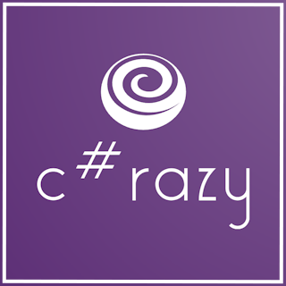

# 👋 Привет! Я — Aleksandr

🎯 Senior Backend Engineer | 12+ лет в IT | .NET Enthusiast

---

💻 **Обо мне**

Меня зовут Александр, и я уже более 12 лет занимаюсь разработкой бэкенда, в основном на C# и .NET. Разрабатываю высоконагруженные и масштабируемые системы, внедряю DevOps практики и проектирую архитектуру под миллионы пользователей. В моей карьере были как международные продукты, так и локальные стартапы.

---

🧰 **Технологии и инструменты**

- Языки: `C#`, `SQL`, `TypeScript`
- Фреймворки: `.NET`, `ASP.NET Core`, `Entity Framework`
- Базы данных: `PostgreSQL`, `MSSQL`, `Redis`
- Облака: `Azure`, `AWS`
- DevOps: `Docker`, `Kubernetes`, `GitHub Actions`, `Terraform`
- Архитектура: `Event-Driven`, `CQRS`, `DDD`, `Microservices`

---

📢 **Чем делюсь и где пишу**

- 💼 LinkedId: [@aleksandrdotnet](https://www.linkedin.com/in/aleksandrdotnet/) — Основной профиль
- 💻 Telegram: [@aleksandrdotnet](https://t.me/csharprazy) — Блог о разработке
- 📺 YouTube: [@aleksandrdotnet](https://www.youtube.com/@aleksandrdotnet) — делюсь видео по программированию, разработке и карьерным вопросам
- 📸 Instagram: [@aleksandrdotnet](https://www.instagram.com/aleksandrdotnet) — здесь я показываю моменты из жизни и делаю посты по развитию навыков
- 𝕏 X/Twitter: [@aleksandrdotnet](https://x.com/aleksandrdotnet) — делюсь короткими мыслями и новостями
- 🔵 Bluesky: [@aleksandrdotnet](https://bsky.app/profile/aleksandrdotnet.bsky.social) — для более личных размышлений
- 🎵 TikTok: [@aleksandrdotnet](https://www.tiktok.com/@aleksandrdotnet) — делюсь быстрыми инсайтами и смешными моментами из IT
- ✳️ Linktr: [@aleksandrdotnet](https://linktr.ee/aleksandrdotnet) — Всё и сразу

---

🎓 **Менторство**

Помогаю новичкам войти в IT: провожу индивидуальные созвоны, разбираем CV, путь развития и технические задачи.